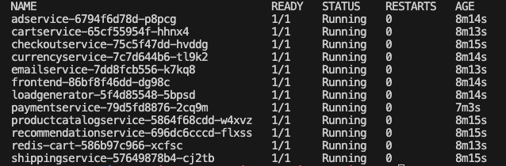
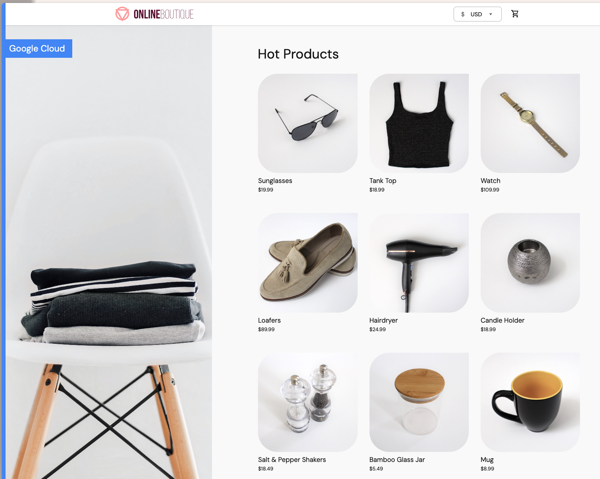
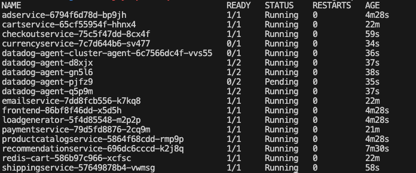
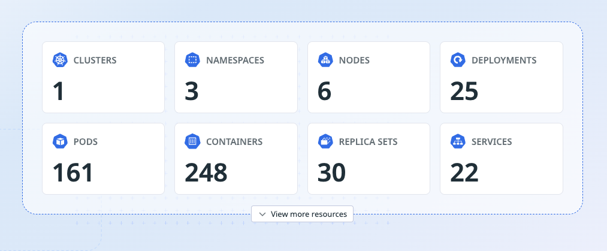
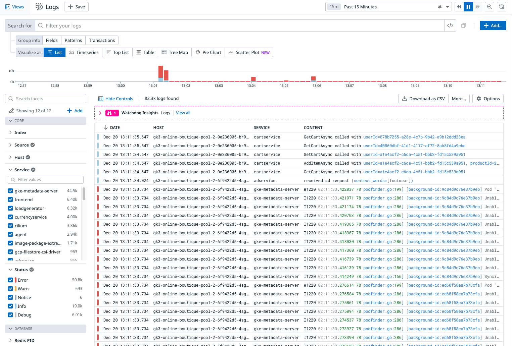

# Helm chart for Online Boutique

If you'd like to deploy Online Boutique via its Helm chart, you could leverage the following instructions.

**Warning:** Online Boutique's Helm chart is currently experimental. If you have feedback or run into issues, let us know inside [GitHub Issue #1319](https://github.com/GoogleCloudPlatform/microservices-demo/issues/1319) or by creating a [new GitHub Issue](https://github.com/GoogleCloudPlatform/microservices-demo/issues/new/choose).

A cluster is needed first before deployment so first make sure you have followed steps 1-5 from [Quickstart Guide](./README.md).

Deploy the default setup of Online Boutique:
```sh
helm upgrade onlineboutique oci://us-docker.pkg.dev/online-boutique-ci/charts/onlineboutique \
    --install
```

After this if you run
```
kubectl get pods
```

You should see a list of running pods.


Get the external IP address of the frontend:

```
export SERVICE_IP=$(kubectl get svc --namespace default frontend-external --template "{{ range (index .status.loadBalancer.ingress 0) }}{{.}}{{ end }}")
    echo http://$SERVICE_IP
```

You should see the e-commerce store up and running


Add the Datadog Helm Repository
```sh
helm repo add datadog https://helm.datadoghq.com
helm repo update
```

Create a Kubernetes secret with your API keys (API Key can be found inside your DD Account, Under Organisation > Access > API Keys)
```
kubectl create secret generic datadog-secret --from-literal api-key=XXXXXXXXXXXXXXXXXXXXXXXXXXXXXXXX
```

Review the values inside [datadog-values.yaml](./datadog-values.yaml). 

Deploy Agent with the above configuration file. (Make sure you are inside the folder /helm-chart)

```
helm install datadog-agent -f datadog-values.yaml datadog/datadog
```

After this if you run
```
kubectl get pods
```

You should see a list of running pods plus the agent pods.


If deployment has been successful you will be able to view the kubernetes hosts and containers on the dd platform.





For the full list of configurations, see [values.yaml](./values.yaml).

Reminder to delete your GKE cluster at the end
```
gcloud container clusters delete online-boutique \
  --project=${PROJECT_ID} --region=${REGION}
```

You could also find advanced scenarios with these blogs below:
- [Online Boutique sample’s Helm chart, to simplify the setup of advanced and secured scenarios with Service Mesh and GitOps](https://medium.com/google-cloud/246119e46d53)
- [gRPC health probes with Kubernetes 1.24+](https://medium.com/google-cloud/b5bd26253a4c)
- [Use Google Cloud Spanner with the Online Boutique sample](https://medium.com/google-cloud/f7248e077339)